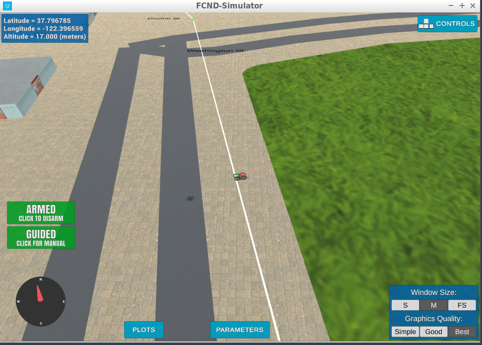
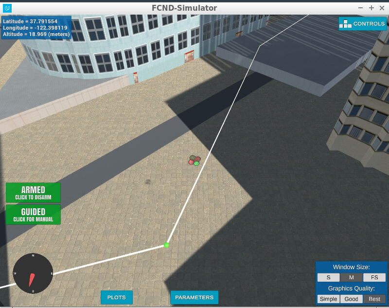
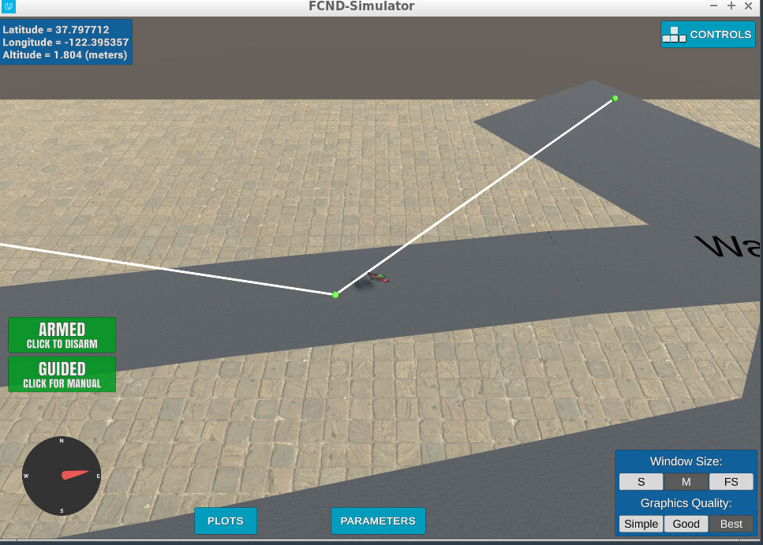
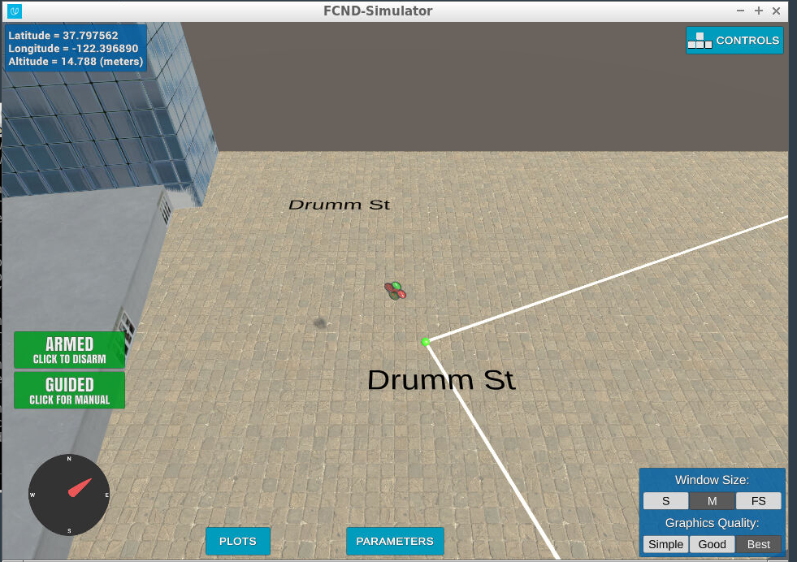

## Project: 3D Motion Planning

This project is part of Udacity flying car nanodegree program focused on 3D motion planning. To execute the project, download the Udacity simulator version v0.1.1 from the following link: https://github.com/udacity/FCND-Simulator-Releases/releases

If Miniconda is not installed, install miniconda ([miniconda official site](https://docs.conda.io/en/latest/miniconda.html)) and set up the Python environment using the environment.yml file as below. This step could take up to 20 min.
```sh
conda env create -f environment.yml
```

Clone this repository:
```sh
git clone https://github.com/miniermatar/FCND-Motion_planning
```

This motion planning project is based on probabilistic roadmap. For simplicity, a 3D graph of the environment have been created and saved as a gpickle file. To run the motion planning process with the pre-created graph, run the following script:
```sh
python motion_planning.py
```

Please note that the Udacity simulator has an unexpected obsticle at startup, the drone should be moved to a different location before running the motion planning script. More details on the issue in the links below:

https://github.com/udacity/fcnd-issue-reports/issues/392

https://knowledge.udacity.com/questions/846330

## [Rubric](https://review.udacity.com/#!/rubrics/1534/view) Points

### Below i will explain how I addressed each point of the rubric in my implementation.  

### Writeup / README

#### 1. Provide a Writeup / README that includes all the rubric points and how you addressed each one.  You can submit your writeup as markdown or pdf.  
You're reading it! Below I describe how I addressed each rubric point and where in my code each point is handled.

### Explain the Starter Code
#### 1. Explain the functionality of what's provided in `motion_planning.py` and `planning_utils.py`
The code provided calculate a path from a specific location (center of the grid) to the goal that is 10 meter north and 10 meter east. It uses the colliders.csv data to create a grid of the city (at a specific altitude) and then run A* to find the path. 

### Implementing Your Path Planning Algorithm
#### 1. Set your global home position
The global position was read from the colliders.csv file and the coordinates were extracted using the `re` library as shown below:
```sh
        f_line= open("colliders.csv", "r")
        start_loc = re.findall("[-\d]+\.\d+",f_line.readline())
        lat=float(start_loc[0])
        lon=float(start_loc[1])
        f_line.close()
        self.set_home_position(lon,lat,0)  
```

#### 2. Set your current local position
The local position of the drone was determined using the `global_to_local` function from the Udacidrone API as shown below:
```sh
north,east,down = global_to_local(self.global_position, self.global_home)
```

#### 3. Set grid start position from local position
The start position is determined as the current position of the drone. It could also be a position on top of a building.

#### 4. Set grid goal position from geodetic coords
The goal position is randomly determined by selecting a random geodetic coordinate and then converting it to local coordinates. The coordinates are checked to ensure they are ithin the boundaries of the provided data, as shown below:
```sh
print("\tFinding goal ...")
while True:
    goal_lon=np.random.uniform(-122.40107126,-122.39054357)
    goal_lat=np.random.uniform(37.78848764,37.79673471)

    goal_pos=np.array([goal_lon,goal_lat,-5]) #altitude set 5 meters above the ground
    goal_pos_local=global_to_local(goal_pos,global_home)

    if within_boundaries (data,goal_pos_local)==True:
        goal_pos_graph=closest_neighbor(g,goal_pos_local,polygons)
        if closest_neighbor(g,goal_pos_local,polygons)!=None:
            break
```

#### 5. Modify A* to include diagonal motion (or replace A* altogether)
This project uses probabilistic roadmaps to find a free path between start and goal positions. The search is done using the A* algorithm modified to support NetworkX graphs. Since the creating of a graph is a time consuming task (and since the environment where the drone will fly is static), a graph was created once and saved as a gpickle file: `graph.gpickle` and read during runtime. If needed, new map of the environment can be created by running the following script. This will overwrite the existing graph and the process could take up to 5 min.
```sh
python generate_graph.py
```
The implementation of the A* algorithm can be found in `planning_utils.py` under the `a_star` function.

#### 6. Cull waypoints 
Since this implementation is based on probabilistic roadmap, cull waypoints was not needed.

### Execute the flight
#### 1. Does it work?
It works! Few pictures below:




  
# Extra Challenges: Real World Planning
Some additional real world challenges were considered and implemented as explained below.

## Waypoint headings:
As the drone move through the city, it’s yaw angle is updated to match the direction of flight. This was accomplished through code below in `planning_utils.py`:
```sh
for i in range(0,len(waypoints)-1,1):
    waypoints[i+1][3]=np.arctan2((waypoints[i+1][1]-waypoints[i][1]), (waypoints[i+1][0]-waypoints[i][0]))
```
Below is a picture of the drone with the same orientation as the path:


## Deadband adjustment:
To allow for a flexible deadband as the drone flight through the different waypoints, the criteria for deciding when to switch waypoints was adjusted based on the drone velocity. That was added in the local position callback. The criteria is that the position should be less than 10* of the drone velocity + 0.2. The addition of the 0.2 is for cases where velocities are close to zero (typically on the last waypoint). Code below:
```sh
def local_position_callback(self):
    if self.flight_state == States.TAKEOFF:
        if -1.0 * self.local_position[2] > 0.95 * self.target_position[2]:
            self.waypoint_transition()
    elif self.flight_state == States.WAYPOINT:
        #deadband is adjusted based on drone velocity
        if np.linalg.norm(self.target_position[0:2] - self.local_position[0:2]) < (0.1* np.linalg.norm(self.local_velocity[0:2])+0.2):
            if len(self.waypoints) > 0:
                self.waypoint_transition()
            else:
                if np.linalg.norm(self.local_velocity[0:2]) < 1.0:
                    self.landing_transition()
```

## Landing on top of buildings:
The code has the ability to land on top of buildings. To achieve that, the local velocity callback will start the disarming process once the drone velocity is less than 0.001 (now, it is not related to the altitude as in the original code). Code below:
```sh
def velocity_callback(self):
    if self.flight_state == States.LANDING:
        if np.linalg.norm(self.local_velocity[0:2]) < 0.001:
            self.disarming_transition()
```

## Take off from the roofs:
If the drone start position is on top of a building, the take off command will make the drone go 5 meters above its current starting altitude and it will identify the closest node to that position.


